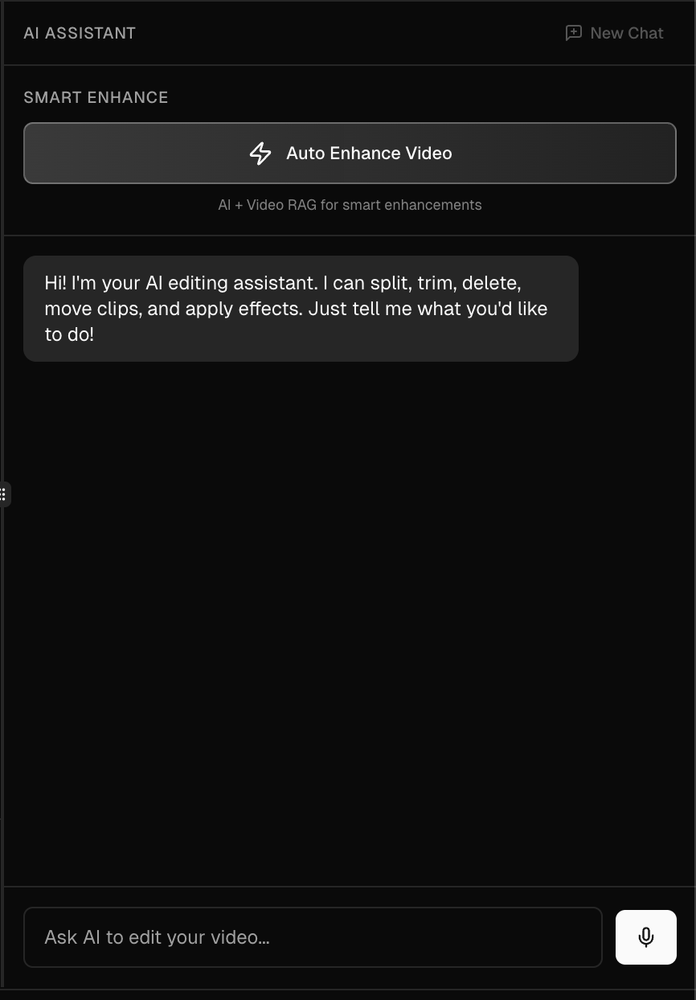
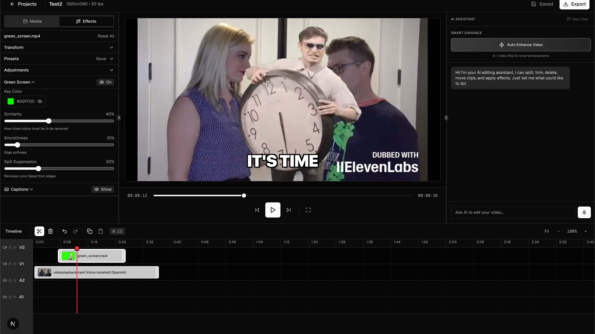

<div align="center">
  
  
  # CutOS
  
  **Edit videos at the speed of thought**
  
  [](https://nextjs.org/)
  [](https://react.dev/)
  [](https://www.typescriptlang.org/)
  [](https://opensource.org/licenses/MIT)
  
  [Demo](https://cutos.vercel.app) · [Report Bug](https://github.com/shamsharoon/cutos/issues) · [Request Feature](https://github.com/shamsharoon/cutos/issues)
</div>

---

## 🎬 Overview

CutOS is an **AI-first video editor** that understands natural language. Describe your edits in plain English, and watch them happen instantly. No steep learning curves, no complex menus—just tell the AI what you want.

> *"Split this clip at 10 seconds and add a vintage effect"* — Done.

### ✨ Why CutOS?

- 🤖 **Conversational Editing** - Edit videos by describing what you want
- 🔍 **Semantic Search** - Find moments in footage using natural language
- 🌍 **29-Language Dubbing** - Translate while preserving emotion and timing
- 🎨 **Real-Time Effects** - GPU-accelerated WebGL rendering
- 📱 **Web-Based** - No installation required, works in your browser

<!-- Add demo GIF here -->

*AI-powered editing in action*

---

## 🚀 Features

### 🎙️ AI-Powered Tools

| Feature | Description |
|---------|-------------|
| **Natural Language Editing** | "Split the clip in half and apply noir effect" — AI executes complex multi-step operations |
| **Semantic Video Search** | Find specific moments: "person walking", "car driving" — powered by TwelveLabs Marengo 3.0 |
| **AI Dubbing** | Translate to 29 languages while preserving speaker emotion and timing (ElevenLabs) |
| **Voice Isolation** | Remove background noise, music, and ambient sounds — keep only the voice |
| **AI Morph Transitions** | Generate smooth morphing transitions between clips (Kling API) |

### 🎬 Professional Editing

- **Multi-Track Timeline** - 2 video tracks + 2 audio tracks with non-destructive editing
- **Precision Tools** - Split, trim, extend clips with frame-perfect accuracy
- **Drag & Drop** - Magnetic snapping for seamless clip placement
- **Real-Time Preview** - Canvas-based playback with instant effect rendering
- **Effect Library** - Grayscale, sepia, VHS, glitch, cyberpunk, ASCII art, and more
- **Chromakey** - GPU-accelerated green screen removal (any color)
- **Undo/Redo** - Full editing history with keyboard shortcuts

### 🎨 Visual Effects

<!-- Add effect showcase image -->


### 📤 Export & Cloud

- Export to MP4/WebM at 1080p
- Cloud storage with Supabase
- Auto-save your projects
- Multiple quality presets (Low/Medium/High)

---

## 📸 Screenshots

<!-- Add screenshots in /docs/images/ folder -->

<div align="center">
  
  <p><em>Main editing interface with timeline and preview</em></p>
</div>

<div align="center">
  
  <p><em>Natural language AI editing assistant</em></p>
</div>

<div align="center">
  
  <p><em>Real-time effects with adjustable parameters</em></p>
</div>

---

## 🛠️ Tech Stack

<div align="center">

### Frontend


### AI & APIs


### Backend & Services


</div>

---

## 🏃 Quick Start

### Prerequisites

- Node.js 18+
- npm/pnpm
- Supabase account
- API keys (OpenAI, TwelveLabs, ElevenLabs, Kling)

### Installation

```bash
# Clone the repository
git clone https://github.com/shamsharoon/cutos.git
cd cutos

# Install dependencies
npm install

# Copy environment variables
cp .env.example .env.local

# Add your API keys to .env.local
# See "Environment Variables" section below
```

### Environment Variables

Create a `.env.local` file:

```bash
# Supabase
NEXT_PUBLIC_SUPABASE_URL=your_supabase_url
NEXT_PUBLIC_SUPABASE_ANON_KEY=your_anon_key
SUPABASE_SERVICE_ROLE_KEY=your_service_role_key

# AI Services
OPENAI_API_KEY=your_openai_key
TWELVELABS_API_KEY=your_twelvelabs_key
ELEVENLABS_API_KEY=your_elevenlabs_key
KLING_ACCESS_KEY=your_kling_access_key
KLING_SECRET_KEY=your_kling_secret_key
```

### Run Development Server

```bash
npm run dev
```

Open [http://localhost:3000](http://localhost:3000)

---

## 🎯 Usage Examples

### Natural Language Editing

```
User: "Split the clip at 15 seconds and add a vintage VHS effect"
AI: ✓ Split at 15s. Applied VHS effect.

User: "Remove the green screen from intro.mp4"
AI: ✓ Green screen removed from 'intro.mp4'.

User: "Dub this video in Spanish"
AI: ✓ Dubbing to Spanish... (this may take a moment)
```

### Semantic Video Search

```
Search: "person walking on beach"
→ Finds all clips with people walking on beaches

Search: "car driving at night"
→ Finds nighttime driving scenes
```

---

## 📁 Project Structure

```
cutos/
├── app/                      # Next.js App Router
│   ├── api/                  # API routes
│   │   ├── agent/           # AI agent endpoint
│   │   ├── dub/             # Dubbing API
│   │   ├── remove-noise/    # Voice isolation
│   │   └── twelvelabs/      # Video search
│   ├── projects/            # Project pages
│   └── page.tsx             # Landing page
├── components/              # React components
│   ├── ui/                  # shadcn/ui components
│   ├── editor-shell.tsx     # Main editor
│   ├── timeline.tsx         # Timeline component
│   └── media-panel.tsx      # Media library
├── lib/                     # Utilities
│   ├── agent/              # AI agent logic
│   ├── supabase/           # Database client
│   └── utils.ts            # Helper functions
└── public/                  # Static assets
```

---

## 🎨 Creating GIFs & Screenshots

### For Demo GIFs

1. **Record with OBS/QuickTime**
   - Record your screen at 1920x1080
   - Keep recordings under 30 seconds for optimal file size
   - Focus on one feature at a time

2. **Convert to GIF**
   ```bash
   # Using FFmpeg
   ffmpeg -i input.mp4 -vf "fps=15,scale=1000:-1:flags=lanczos" -c:v gif output.gif
   
   # Or use online tools:
   # - https://ezgif.com/video-to-gif
   # - https://cloudconvert.com/mp4-to-gif
   ```

3. **Optimize GIF Size**
   ```bash
   # Using gifsicle
   gifsicle -O3 --colors 256 output.gif -o optimized.gif
   ```

### File Organization

```
cutos/
├── docs/
│   ├── demo.gif              # Main demo GIF (homepage)
│   ├── effects-showcase.png  # Effects preview
│   └── images/
│       ├── editor-interface.png
│       ├── ai-chat.png
│       ├── effects-panel.png
│       ├── timeline-editing.gif
│       └── search-demo.gif
└── public/
    └── demo.mp4              # Demo video for landing page
```

### Screenshot Tips

- Use full editor interface at 1920x1080
- Crop to show relevant sections
- Add subtle drop shadows in post
- Use dark mode for consistency
- Compress with TinyPNG or similar

---

## 🎮 Keyboard Shortcuts

| Shortcut | Action |
|----------|--------|
| `Space` | Play/Pause |
| `Cmd/Ctrl + Z` | Undo |
| `Cmd/Ctrl + Shift + Z` | Redo |
| `Cmd/Ctrl + C` | Copy selected clip |
| `Cmd/Ctrl + V` | Paste clip |
| `S` | Split clip at playhead |
| `Delete` | Delete selected clip |
| `Esc` | Exit fullscreen |

---

## 🤝 Contributing

Contributions are welcome! Please feel free to submit a Pull Request.

1. Fork the project
2. Create your feature branch (`git checkout -b feature/AmazingFeature`)
3. Commit your changes (`git commit -m 'Add some AmazingFeature'`)
4. Push to the branch (`git push origin feature/AmazingFeature`)
5. Open a Pull Request

---

## 🐛 Known Issues

- Voice isolation requires clips to be uploaded to cloud storage first
- Morph transitions only work between sequential clips on the same track
- Large video files (>500MB) may experience slower processing

---

## 📝 License

This project is licensed under the MIT License - see the [LICENSE](LICENSE) file for details.

---

## 🙏 Acknowledgments

- **TwelveLabs** - Semantic video understanding
- **ElevenLabs** - Voice AI technology
- **OpenAI** - GPT-4o for intelligent editing
- **Kling AI** - Morph transition generation
- **Supabase** - Backend infrastructure
- **Vercel** - Hosting and deployment

---

## 📧 Contact

Project Link: [https://github.com/shamsharoon/cutos](https://github.com/shamsharoon/cutos)

Demo: [https://cutos.vercel.app](https://cutos.vercel.app)

---

<div align="center">
  <sub>Built with ❤️ for creators who move fast</sub>
</div>
